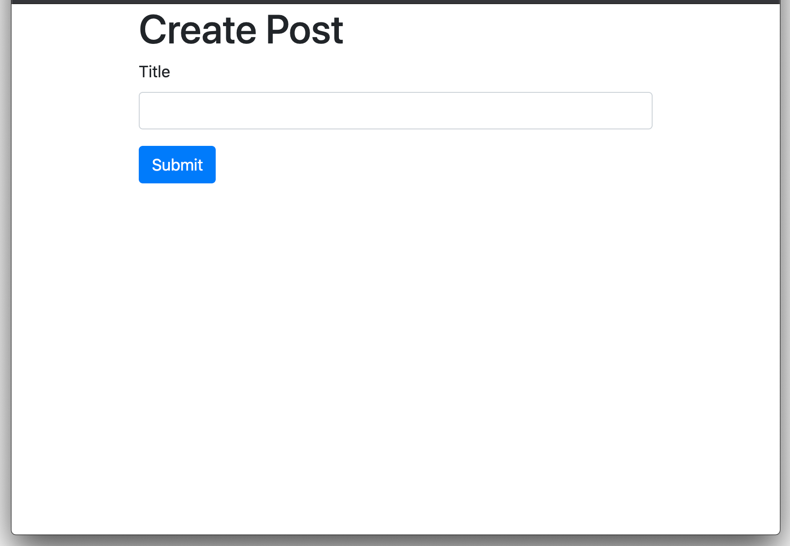
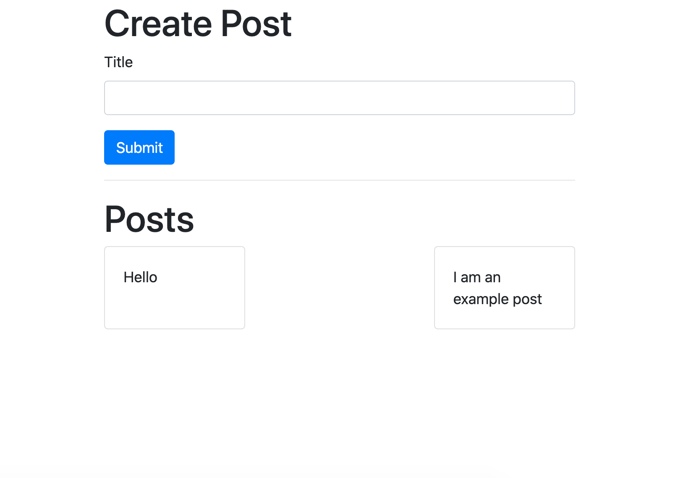
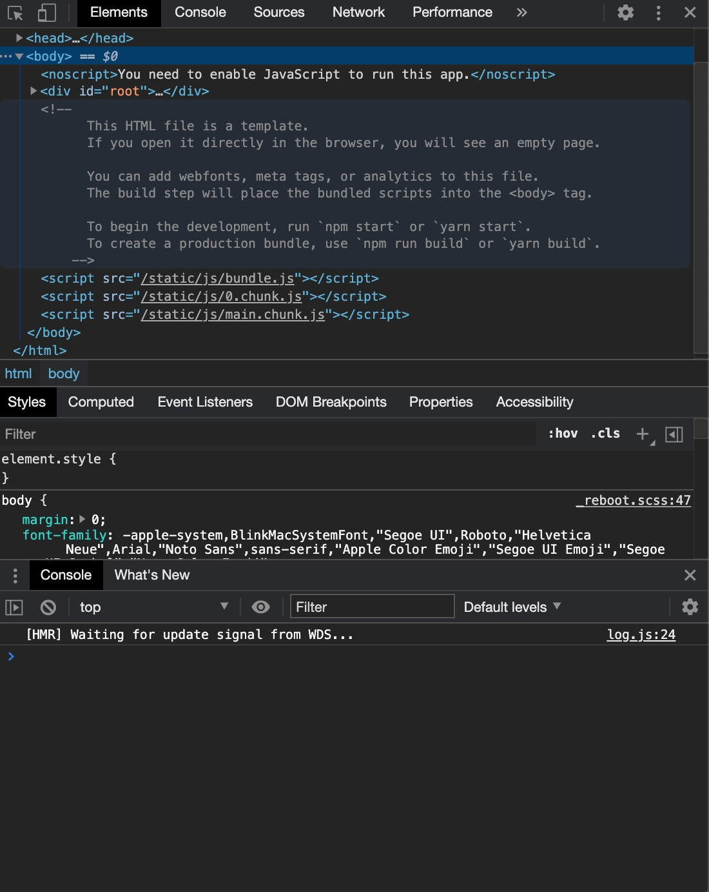
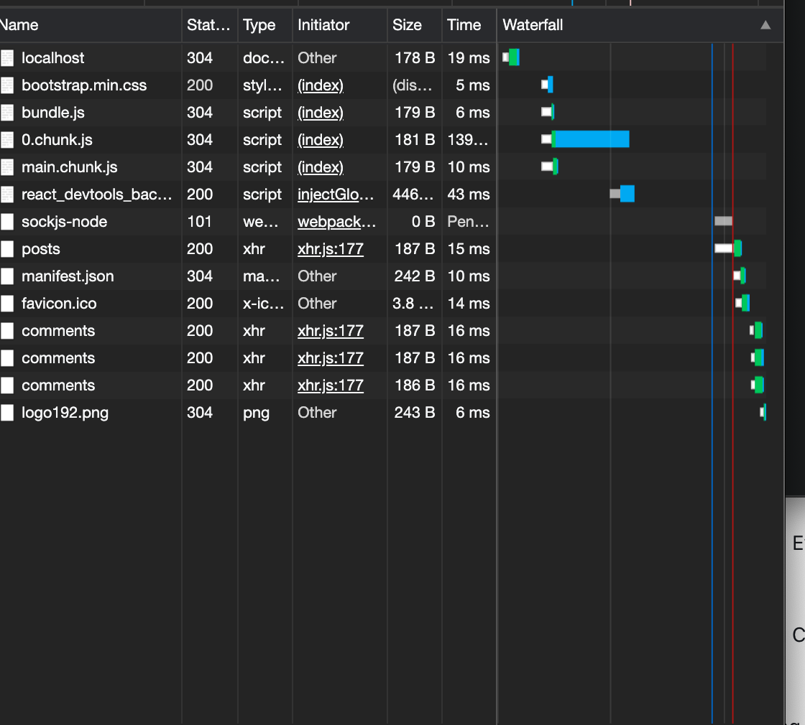

# What are microservices 

As a software engineer or web developer, you've probably heard the term "microservice" before, but for less seasoned developers, the concept of microservices is likely an unfamiliar and seemingly daunting term. 

The goal here is to break it down - explain what it is and why you should care. 


## Monoliths and the "monolithic server"

Before we can understand microservices, it's important to understand the traditional architecture used for building applications, commonly referred to as the "monolithic server". 

The traditional full-stack applications is engineered into two primary parts:
1. The client (front-end) 
2. The server (back-end)

This segments the presentation and of information and the implementation of business logic into the front-end, while the backend supports those features and enables persistence of data. 

### Monoliths 

[Meriam-webster](https://www.merriam-webster.com/dictionary/monolithic) defines "monolith" as: 
1. "a single great stone often in the form of an obelisk or column" 
2. "a massive structure" 
3. "an organized whole that acts as a single unified powerful or influential force" 

While not specific to software, the analogy is the same. 

Typically the monolithic architecture is referencing the back-end (server) that supports data persistence and handles all the logic pertaining to creating, modifying, deleting, and retrieving information related to an application (or applications). 

With Monolithic servers, every feature is run on the _same_ system (computer/server) and is part of the _same_ codebase and the _same_ database. 


**In short → a monolithic application, implements every feature of the application.** 

### Microservice Applications 

Microservices are design around the applications features.With each microservice operating independently from each other, but working together to support all the functionality of the application. 

In the microservice application architecture, each feature has _its own small service_ called a "microservice" with no dependencies on the other services or features offered as part of the application.  


### Microservices vs. Monoliths 

If each approach was taken to the extreme... 
* a **monolithic** server architecture would consist of a single server responsible for all the features, functions and middleware of the application such as: 
  * routing 
  * authentication
  * business logic 
  * database interactions
* a **microservice** based architecture would consist of multiple servers. Each server supporting all the functionality associated with a single feature of the application, and each microservice having independent routing, independent code bases, independent business logic, independent authentication, and independent data management.  

### Implications 

The important take-away is that each microservice is **self-contained**, without any dependence on the other microservices. Using more technical terms, the features assocaited with the application in a monolithic application architecture are [_tightly coupled_](https://stackoverflow.com/questions/2832017/what-is-the-difference-between-loose-coupling-and-tight-coupling-in-the-object-o#:~:text=Tight%20coupling%20is%20when%20a,than%20having%20its%20own%20class.) together. 

This results in an application and development workflow that tightly ties together different developers from different teams, working on different features to a single shared code base, running the same shared middleware, and accessing the same shared database. In short, the application's features are highly dependent upon each other and a single feature breaking could result in the entire application failing. 

Microservices seek to address this architectural issue, by making independent servers or services ("microservices") that **only** are responsible for a single feature of the application. 
 
In a microservice based architecture, routing, authentication, business logic, and database interactions, are all wrapped into small independent pieces ("microservices") and have can operate on their own. With microservices, no feature of the application is dependent on shared code or servers. 

This is similar to the idea behind "thin vertical slices" ([here] is an explanation of thin vertical slices if you are not familiar with the approach) commonly embraced in agile methodologies as well as the [single responsibility principle](https://rb.gy/ihrzdu). 

#### The problem with the monolithic approach

If a hardware failure occurs in a monolithic architecture, the entire application can be broken, since all of the features, routing, middleware, business logic, and database interactions all occur on the same system. 

Similarly, since every feature is running on a single server, that server is using a large code base, that is shared between multiple developer/engineers and teams. As a result each feature is highly dependent on the others, and any addition or modification to the functionality of the application means modifying the code for the entire application. 

#### Drawbacks of Microservices 

The microservice approach sounds great so far, but there are some drawbacks.

1. Communication between services
    * most applications require information from one feature in order to implement another feature. Since the microservice makes each feature independent of each other, data is managed independently and is not inherently available to other parts of the application. 
2. Greater resource requirements  
    * Data  management 
        * Data Duplication: 
            * to avoid being reliant on other microservices, most applications implemented with a microservice architecture duplicate data, with each service having its own copy of the information it needs to operate.  
        * Data model associations
            * associating information from one microservice to another is a complex process, since each service has no direct access to the database pertaining to another feature of the application. 
    * More computing resources:
        * in order to be truly independent from the other microservices, each microservice must run on a server/computer that is only used for that feature.
        * for every feature to work in microservice architecture, multiple servers must all be running at the same time (compared to a single server in the monolithic application architecture)
        * development teams will often duplicate efforts implemented in other microservices, writing code that is very similar (if not the same) to the code implementing similar functionality in a different microservice. 
    * More complex testing & debugging 
        * integration testing involving multiple features, is more complicated under the microservice based approach. 
        * logs for each microservice (feature) are on different servers, and could be in completely different formats. 


## Still unclear? 

Hopefully the difference between the fundamental paradigms behind application architecture (microservice vs. monolith) is a little clearer. However, I firmly believe the best approach to understanding anything in software development is to build it. 

If that's of interest to you, look out for a follow-up tutorial demonstrating the microservice architecture. 


---


# Understanding through practice 

If you're still reading, the concepts and impacts, and differences between a monolithic architecture and a microservice architecture are probably still a little unclear. 

Let's create a simple microservice architecture and maybe we can better understand the benefits and drawbacks associated with each approach. 

## Microservices Blog

This simple example will create a blog application in React supported by two `express.js` servers representing our microservices. 

### Posts Microservice  

The first microservice will be responsible for _all_ the functionality necessary to support the feature of creating and retrieving posts. 

#### Responsibilities: 
1. Creating a new post 
2. Retrieving all posts 

| Path | Method | Body? | Desc | 
|:---|:---|:---|:---|
| `/posts` | POST | `{ title: string }` | create a new post | 
| `/posts` | GET | - | retrieve all posts |


### Setup  
1. Navigate to `~/blog/posts/` directory, and `cd` into the `blog/posts/` directory. 

    ```sh
    mkdir blog 
    cd ./blog 
    mkdir posts 
    cd posts 
    ```

2. From the `/posts` directory, run `npm init -y` to create a `package.json`. Then install the necessary dependencies: 

    Initialize npm 
    ```sh
    npm init -y 
    ```
    Install npm packages
    ```sh
    npm install axios express cors nodemon  
    ```

    The `package.json` should now similar to the following: 

    ```json
    {
      "name": "posts",
      "version": "1.0.0",
      "description": "",
      "main": "index.js",
      "dependencies": {
        "axios": "^0.21.0",
        "cors": "^2.8.5",
        "express": "^4.17.1",
        "nodemon": "^2.0.6"
      },
      "devDependencies": {},
      "scripts": {
        "test": "echo \"Error: no test specified\" && exit 1"
      },
      "keywords": [],
      "author": "",
      "license": "ISC"
    }
    ```

3. Within `/posts`, create an `index.js` file. This will be the entry point to the Posts microservice. 

    ```sh
    touch index.js 
    ```

4. Open the `~/blog/posts/index.js` file, and create the express app for the posts microservice. 

    1. We begin by creating the express app. 

        ```js  
        // ~/blog/posts/index.js
        const express = require('express') 

        // create express app 
        const app = express() 
        ```

    2. Next, we will define the routes for our `GET` and `POST` methods to `/posts` 

        ```js
        // ~/blog/posts/index.js
        const express = require('express') 
        
        // app setup 
        const app = express() 

        // GET '/posts' request handler 
        app.get('/posts', (req, res) => { /* todo */})

        // POST '/posts' request handler 
        app.post('/posts', (req, res) => { /* todo */})
        ```

    3. Define the microservice port, and start the server: 

        ```js
        // ~/blog/posts/index.js
        const express = require('express')  

        // app setup 
        const PORT = 4000 // Set the port 
        const app = express() 

        app.get('/posts', (req, res) => { /* todo */})

        app.post('/posts', (req, res) => { /* todo */})

        // start the app 
        app.listen(4000, () => console.log(`posts service listening on ${PORT}))
        ```

    4. Create a variable to store posts, and setup GET to `/posts` to return that object. 

        ```js
        // ~/blog/posts/index.js
        const express = require('express')  

        // basic express app setup 
        const PORT = 4000 
        const app = express() 

        const posts = {} // posts object 

        // get route handler 
        app.get('/posts', (req, res) => {
          res.send(posts) // handle GET 
        })

        // post route handler 
        app.post('/posts', (req, res) => {})

        app.listen(4000, () => console.log(`posts service listening on ${PORT}))
        ```

    5. Generate random `id` using the `randomBytes` function provided from the `crypto` package, middleware to parse the body using the `bodyParser` package as well as handle CORS using `cors` middleware, and handle creating posts from POST request to `/posts` by adding the data from the request to the `posts` objects and returning the newly created post. 
    
        ```js
        // ~/blog/posts/index.js
        const express = require('express')  
        const bodyParser = require('body-parser') // require bodyParser package 
        const cors = require('cors') // require cors package 
        const { randomBytes } = require('crypto') // require randomBytes function from crypto package 

        // app setup 
        const PORT = 4000 
        const app = express() 
        // middleware 
        app.use(bodyParser.json()) // implement bodyParser middleware 
        app.use(cors()) // implement cors middleware 


        const posts = {} 


        app.get('/posts', (req, res) => {
          res.send(posts) 
        })

        app.post('/posts', (req, res) => {
          const id = randomBytes(4).toString('hex');  // create random ID (as a string, something like: `799bdeee8`)
          const { title } = req.body; // get post title 

          posts[id] = { id, title }  // save post 
          res.status(201).send(posts[id]) // return saved posts
        })

        app.listen(4000, () => console.log(`posts service listening on ${PORT}))
        ```

    6. Add the startup script to the `~/blog/posts/package.json` using nodemon./ 

        ```json
        /* ~/blog/posts/package.json */
        {
          "name": "posts",
          "version": "1.0.0",
          "description": "",
          "main": "index.js",
          "dependencies": {
            "axios": "^0.21.0",
            "cors": "^2.8.5",
            "express": "^4.17.1",
            "nodemon": "^2.0.6"
          },
          "devDependencies": {},
          "scripts": {
            "test": "echo \"Error: no test specified\" && exit 1", 
            "start": "npx nodemon index.js" 
          },
          "keywords": [],
          "author": "",
          "license": "ISC"
        }
        ```

### Comments Microservice 

The comments service will function similar to the `express` app setup for the Posts service. 

#### Responsibilities: 

1. Creating a comment associated with a given post ID 
2. Retrieve all comments associated with a given post ID 

| Path | Method | Body? | Desc | 
|:---|:---|:---|:---|
| `/posts/:id/comments` | POST | `{ content: string }` | create a new comment associated with the given post | 
| `/posts/:id/comments` | GET | - | retrieve all comments associated with a given post ID | 

### Setup 

1. Open `~blog/comments/` directory in terminal, initialize npm and install the necessary dependencies. 

    Initialize npm 
    ```sh
    npm init -y 
    ```
    Install npm packages
    ```sh
    npm install axios express cors nodemon  
    ```

    The `~blog/comments/package.json` should now similar to the following: 

    ```json
    {
      "name": "posts",
      "version": "1.0.0",
      "description": "",
      "main": "index.js",
      "dependencies": {
        "axios": "^0.21.0",
        "cors": "^2.8.5",
        "express": "^4.17.1",
        "nodemon": "^2.0.6"
      },
      "devDependencies": {},
      "scripts": {
        "test": "echo \"Error: no test specified\" && exit 1"
      },
      "keywords": [],
      "author": "",
      "license": "ISC"
    }
    ```

2. Within `~blog/comments`, create an `~blog/comments/index.js` file. This will be the entry point to the Comments microservice. 

    ```sh
    touch index.js 
    ```

3. Open the `~blog/comments/index.js` and setup the comments express application 

    ```js
    // require packages
    const express = require('express')
    const bodyParser = require('bodyParser') 
    const cors = require('cors')
    const { randomBytes } = require('crypto') 

    // setup app 
    const PORT = 4001 
    const app = express() 
    // setup middleware 
    app.use(bodyParser.json()) // parse body of requests as json 
    app.use(cors())

    // add route handlers 
    app.get('/posts/:id/comments', (req, res) => { /* todo */ }) // GET  
    app.post('/posts/:id/comments', (req, res) => { /* todo */ }) // POST 

    // setup listen 
    app.listen(PORT, () => console.log(`listening on port ${PORT})) 
    ```

4. Implement functionality for the create a new comment via the POST request to to `/posts/:id/comments`. 

    The `commentsByPostId` object will store comments as objects contained in an array, associated with a key-value of the associated post. It will look something like: 

    ```js
    commentsByPostId = {
      "799bdeee8": [{ id: "f29Lcede8", content: "I am a comment!"}, { id: "f29Lcede8", content: "I am a ALSO comment!"}]]
      "8efgd5238": [{ id: "cdeg79e8", content: "I am a comment on a different post!"}]]
    }
    ```

    * The key of `commentsByPostId` will be the `id` of the associated post. 
    * They value associated with the key will be an array of comments object 

    ```js
    const express = require('express')
    const bodyParser = require('bodyParser') 
    const cors = require('cors')
    const { randomBytes } = require('crypto') 

    const PORT = 4001 
    const app = express() 
    app.use(bodyParser.json()) 
    app.use(cors())

    const commentsByPostId = {}  


    app.get('/posts/:id/comments', (req, res) => { /* todo */ }) /
    app.post('/posts/:id/comments', (req, res) => { 
      // generate random id 
      const commendId = randomBytes(4).toString('hex')

      // retrieve comment from request 
      const { content } = req.body 

      // see if we already have any comments for the associated post 
      let comments = commentsByPostId[req.params.id]  // will return an a) array or b) undefined 
      
      // if undefined, set it to an empty array 
      if (!comments)  {
        comments = [] 
      }

      // add the new comment 
      comments.push({ id: commendId, content })

      // save the new/modified array 
      commentsByPostId[req.params.id] = comments 

      // return all the comments 
      res.status(201).send(commentsByPostId)
    }) 

    app.listen(PORT, () => console.log(`listening on port ${PORT})) 
    ```

5. Implement the GET route handler to `/posts/:id/comments`. 

    ```js
    const express = require('express')
    const bodyParser = require('bodyParser') 
    const { randomBytes } = require('crypto') 
    const cors = require('cors')

    const PORT = 4001 
    const app = express() 
    app.use(bodyParser.json())
    app.use(cors())

    const commentsByPostId = {}  

    app.use(bodyParser.json()) 

    // GET 
    app.get('/posts/:id/comments', (req, res) => { 
      // return an empty array if no comments exist for the provided key 
      res.send(commentsByPostId[req.params.id] || []) 
    }) 

    // POST 
    app.post('/posts/:id/comments', (req, res) => { 
      // generate random id 
      const commendId = randomBytes(4).toString('hex')
      const { content } = req.body 

      const comments = commentsByPostId[req.params.id]  || []  
      comments.push({ id: commendId, content })
      commentsByPostId[req.params.id] = comments 

      res.status(201).send(commentsByPostId)
    }) 

    app.listen(PORT, () => console.log(`listening on port ${PORT})) 

    ```

6. Add the startup script to the `~/blog/comments/package.json` using nodemon./ 

    ```json
    /* ~/blog/posts/package.json */
    {
      "name": "posts",
      "version": "1.0.0",
      "description": "",
      "main": "index.js",
      "dependencies": {
        "axios": "^0.21.0",
        "cors": "^2.8.5",
        "express": "^4.17.1",
        "nodemon": "^2.0.6"
      },
      "devDependencies": {},
      "scripts": {
        "test": "echo \"Error: no test specified\" && exit 1", 
        "start": "npx nodemon index.js" 
      },
      "keywords": [],
      "author": "",
      "license": "ISC"
    }
    ```

    We now should have 2 services: 
    1. Posts service (express application running on port 4000)
    2. Comments service (express application running on port 4001) 


## Client 

So that we can see what is happening here, lets setup our client using React. 

### Client Architecture 


  * App → root component 
    * Post List → component showing all the posts 
      * Comment List → component to show the values associated with a post 
      * Create comment → component to create a new comment associated with a post 
    * Create Post → component to create a post 

or in JSX... 

  ```js
    <App>
      <PostList>
        <CommentList />
        <CreateComment />
      </PostList>
      <CreatePost>
    </App>
  ```

### Basic Client Setup 

1. From the project root directory, run `npx create-react-app client` to create a standard React application from the standard template in the `~/blog/client/` directory. 

2. Once the script has finished executing, we will reset the file structure by removing all the template files from the `/blog/client/src/` directory. This will ensure everyone is starting from the same point.  

3. Back in the root of the client directory (`~/blog/client/`), install `axios` using `npm install axios`. We will use this later for HTTP requests. 

4. Create the `~/blog/client/src/index.js` file (to serve as the entry point for the react application) and an `~/blog/client/src/App.js` to serve as the root component for the react application. 

5. Setup `~/blog/client/src/App.js` 

    ```js
    // app.js 
    import React from 'react';

    export const App = () => {
      return (
        <div className="app">
        </div>
      )
    }

    export default App; 
    ```

6. Setup `~/blog/client/src/index.js` 

    ```js
    // index.js 
    import React from 'react' 
    import ReactDOM from 'react-dom'

    import App from './App' // get App component 

    const root = document.getElementById('root') // get root element 
    
    ReactDOM.render(<App />, root) // insert App component into root element 
    ```

> If done correctly, running `npm start` from `~/blog/client/` should compile and the React application and start the development server on port 3000 and display `Compiled successfully!` in the terminal window. 

7. Add bootstrap CSS library for styling using CDN. 
    1. Go to [https://getbootstrap.com/](https://getbootstrap.com/) 
    2. Click the "Get Started" button 
    3. Copy Bootstraps minified CSS link tag  
    4. Add to the `~blog/client/public/index.html` within the `<head> ... </head>` tags. 

    The `<head>` of the `~blog/client/public/index.html` should look something like: 
    ```html 
    <head>
      <meta charset="utf-8" />
      <link rel="icon" href="%PUBLIC_URL%/favicon.ico" />
      <meta name="viewport" content="width=device-width, initial-scale=1" />
      <meta name="theme-color" content="#000000" />
      <meta
        name="description"
        content="Web site created using create-react-app"
      />
      <link rel="apple-touch-icon" href="%PUBLIC_URL%/logo192.png" />
      <!--
        manifest.json provides metadata used when your web app is installed on a
        user's mobile device or desktop. See https://developers.google.com/web/fundamentals/web-app-manifest/
      -->
      <link rel="manifest" href="%PUBLIC_URL%/manifest.json" />
      <link rel="stylesheet" href="https://cdn.jsdelivr.net/npm/bootstrap@4.5.3/dist/css/bootstrap.min.css" integrity="sha384-TX8t27EcRE3e/ihU7zmQxVncDAy5uIKz4rEkgIXeMed4M0jlfIDPvg6uqKI2xXr2" crossorigin="anonymous">
      <!--
        Notice the use of %PUBLIC_URL% in the tags above.
        It will be replaced with the URL of the `public` folder during the build.
        Only files inside the `public` folder can be referenced from the HTML.

        Unlike "/favicon.ico" or "favicon.ico", "%PUBLIC_URL%/favicon.ico" will
        work correctly both with client-side routing and a non-root public URL.
        Learn how to configure a non-root public URL by running `npm run build`.
      -->
      <title>React App</title>
    </head>
    ```

    > This will add some basic styling to the application 👍

8. Build the first component: `<PostCreate />`. 

    Create `~/blog/client/src/PostCreate.js`: 

    ```js
    // PostCreate.js 
    import React from 'react';

    // CreatePosts component 
    export const PostCreate = () => {
      return (
        <div className="postCreate">

        <!-- form for data input -->
        <form>
          <!-- container to hold title for post -->
          <div className="form-group">
            <label>Title</label>
            <input className="form-control" />
          </div>

          <!-- submit button -->
          <button className="btn btn-primary">
            Submit
          </button>

          </form>
        </div>
      )
    } 

    export default PostCreate; 
    ```

9. Add the `<PostCreate>` component to the `<App>` component: 

    ```jsx
    /*  Root Component */
    export const App = () => {
      return (
        <div className="container app">
          <!-- newly created component -->
          <h1>Create Post</h1>
          <PostCreate /> 
        </div>
      )
    }
    ``` 

    On [localhost:3000](http://localhost:3000/), you should now see something like: 

    

10. Add `useState` hook to keep track of the post title to the `<CreatePost> 

    1. Update import statement to pull the `useState` functional hook 
  
    ```js
    import React, { useState } from 'react'` 
    ``` 

    2. Add state to `<CreatePost />` component using the `value` and `onChange` properties of the `<input />` field:  

        ```jsx
        import React, { useState } from 'react'

        export const PostCreate = () => {
          const [title, setTitle] = useState('')
          return (
            <div className="postCreate container">

              <!-- form for post data  -->
              <form>

                <!-- container for post title -->
                <div className="form-group">

                  <label>Title</label>

                  <!-- input assocaited with component state  -->
                  <input className="form-control" 
                    value={title} 
                    onChange={e => setTitle(e.currentTarget.value)} 
                    />
                </div>

                <!-- submit button -->
                <button className="btn btn-primary">
                  Submit
                </button>

              </form>

            </div>
          )
        }
        ```

    3. Add `onSubmit` event handler to the `<form>` element to handle the `POST` request to `/posts/`. 

        ```jsx 
        export const PostCreate = () => {
          const [title, setTitle] = useState('')

          // create post request to passing in the title as our data  
          const handleSubmit = async event => {
            
            // prevent default behavior (which would reload the page )
            event.preventDefault() 

            // send data as a POST request using axios 
            await Axios.post('http://localhost:4000/posts', { title} )
          }

          return (
            <div className="postCreate container">

              <!-- form to enter post data  -->
              <form onSubmit={handleSubmit}>

                <!-- container to hold post title -->
                <div className="form-group">

                  <label>Title</label>

                  <!-- input with event hanlders -->
                  <input className="form-control" 
                    value={title} 
                    onChange={e => setTitle(e.currentTarget.value)} 
                    />
                </div>

                <!-- submit button -->
                <button className="btn btn-primary">Submit</button>
              </form>

            </div>
          )
        }
        ``` 

      4. Modify the `handleSubmit` function to reset the inputs upon successful post creation 

          ```jsx 
          /* submit handler for post creation */ 
          const handleSubmit = async (event) => {
              event.preventDefault() 

              /* make post request */
              const res = await Axios.post('http://localhost:4000/posts', { title} )

              /* parse request to see if status code = 201 (created) */
              if (res.status === 201) {
                setTitle('')
              } else {
                alert('Failed to create new post')
                console.error(res.data)
              }
            } 
          ``` 

11. Now we need to setup the ability to retrieve (GET) posts from our microservice. 

    1. Make a GET request to our posts microservice. 
        * we will use the `useState` React hook to hold the data 
          * update PostList.js component with necessary imports
              ```js
              // postList.js 
              import React, { useState, useEffect } from 'react'
              import Axios from 'axios'
              ```

          * add state to hold posts 
      
            ```js
            // postList.js 
            import React, { useState, useEffect } from 'react'
            import Axios from 'axios'

            export const PostList = () => {
              /* state */
              const [posts, setPosts] = useState({});  /* state */ 
            
              /* JSX */
              return (
                <div className="postList">
                </div>
              )
            }
            ```
        
        * we will use the `useEffect` React hook to make sure the request to the microservice only occurs when the component loads. 
        
            * create the function to execute the GET request to `/posts` microservice:

              ```js
              export const PostList = () => {
                const [posts, setPosts] = useState({}); 

                /* function to retrieve posts */
                const fetchPosts = async () => {
                  const res = await Axios.get('http://localhost:4000/posts')
                  setPosts(res.data)
                }

                /* JSX */
                return (
                  <div className="postList">
                  </div>
                )
              }
              ```

            * execute `fetchPosts` when the component is rendered to the page using the React `useEffect` hook. 

              ```js
              /* Postlist component */
              export const PostList = () => {
                const [posts, setPosts] = useState({}); 

                /* function to retrieve posts */
                const fetchPosts = async () => {
                  const res = await Axios.get('http://localhost:4000/posts')
                  setPosts(res.data)
                }
                
                /* run `fetchPosts` when the component is rendered */
                useEffect(() => {
                  fetchPosts() 
                }, [])

                return (
                  <div className="postList">
                  </div>
                )
              }
              ```

    2. Iterate over the post and display the information: 
        * get the values from the object containing all the posts from the posts microservice: 

            ```js
            const renderedPosts = Object.values(posts)
            ```

            > `Object.values(obj)` returns the values associated with the object provided as the parameters to `Object.values()` 

        * map over the returned array of values, and render them 

          ```js
          const renderedPosts = Object.values(posts).map(post => {
            return (
                <!-- react requires keys for the top level element whenever there is a collection of items being rendered  -->
              <div key={post.id} className="card">
                <div className="card-body">
                  {post.title}
                </div>   
              </div>
            )
          })
          ``` 
  
    3. Add them to the component to rendered to the screen. 

        ```js
        export const PostList = () => {
          /* state to hold posts retrieved from the database */
          const [posts, setPosts] = useState({}); 

          /* function to retrieve posts */
          const fetchPosts = async () => {
            const res = await Axios.get('http://localhost:4000/posts')
            setPosts(res.data)
          }

          /* run `fetchPosts` when the component is rendered */
          useEffect(() => {
            fetchPosts() 
          }, [])

          /* Map the retrieved posts to JSX */
          const renderedPosts = Object.values(posts)
            .map(post => {
              return (
                <!-- react requires keys for the top level element whenever there is a collection of items being rendered  -->
                <div key={post.id} className="card">
                  <div className="card-body">
                    {post.title}
                  </div>   
                </div>
              )
            })

          return (
            <div className="postList">

              <!-- wrapper for styling -->
              <div className="d-flex flex-row flex-wrap justify-content-between">
                <!-- mapped posts as jsx -->
                {renderedPosts}

              </div>
            </div>
          )
        }
        ```

        > Note: the `classNames` here are CSS classes from bootstrap that will add some basic styling 

        We should now be able to refresh the page in the browser and use the form to create a post. 
        
        However, we will have to manually refresh the page after clicking "submit" since the the posts are fetched from the API when the component is rendered to the screen. 
        
        If you create a post and refresh the browser window, you should see the post appear. 

        This is what is looks like with two posts: 

          1. hello
          2. This is a post example

        
          


Now we need to add the ability to comment on a post. So we will create similar components for creating commments through a `<CreateComment />` component, and display the comments for a post using a `<CommentList />` component. 

12. Creating the `<CreateComment />` component. 

    1. In the `~/blog/client/src/` directory, create a `CreateComment.js` file. 

    2. Setup the boiler-plate react component code with the same import statements used for the `<CreatePosts />` component: 

        ```js
        import React, { useState } from 'react';
        import Axios from 'axios'

        /* Create comment component  */ 
        export const CommentCreate = () => {
          return (
            <div className="commentCreate">
            </div>
          )
        }

        export default CommentCreate; 
        ```
      
        Since every comment _needs_ to be associated with a Post, we will need to provide the `id` of the post for which the comments should apply to. We will do this by destructuring the value from `props`. 

        ```js
        // de-structure postId from props 
        export const CommentCreate = ({ postId }) => { /* jsx */ } 
        ```
    3. Now lets add HTML: 

        ```js
        export const CommentCreate = () => {
          return (
            <div className="commentCreate">

              <!-- form -->
              <form>

                <!-- input container -->
                <div className="form-group">
                  <label>new comment</label>
                  <input className="form-control" /> 
                </div>

                <!-- Submit button -->
                <button className="btn btn-primrary">
                  Submit
                </button>

              </form>
               <!-- end of form -->

            </div>
          )
        }
        ```

      4. And add state and event handlers: 

          ```js
          export const CommentCreate = () => {
            const [content, setContent] = useState('') // state 

            const handleSubmit = async (event) => {
              event.preventDefault()
              /* to do */
            }

            return (
              <div className="commentCreate">

                <!-- submit event handler -->
                <form onSubmit={handleSubmit}>
                  
                  <!-- container for input and label -->
                  <div className="form-group">
                    
                    <label>new comment</label>
                    
                    <!-- manage input state -->
                    <input className="form-control"
                      value={content}
                      onChange={(e) => setContent(e.currentTarget.value) }
                      /> 
                  </div>

                  <button className="btn btn-primrary">
                    Submit
                  </button>
                </form>

              </div>
            )
          }
          ```

      5.  Now we update the `handleSubmit` function to send an HTTP POST request to our comments microservice. 

          ```js
          const handleSubmit = async (event) => {
            /* prevent default form behavior */
            event.preventDefault()
            
            /* make the HTTP post request */
            const res = Axios.post(`http://localhost:4001/posts/${postId}/comments`, { content })

            if ((await res).status === 201) {
              /* clear the content of the form since the post was successful */
              setContent('')
            } else {
              /* provide feedback that the POST was unsuccessful */
              alert('Unable to create comment')
              console.error(res.data)
            }
          }
          ```
      
          The result should be a `CommentCreate` component similar to: 

          ```js
          import React, { useState } from 'react';
          import Axios from 'axios'

          /* Create comment component */
          export const CommentCreate = ({ postId}) => {
            /* content of comment managed in state */
            const [content, setContent] = useState('') 

            /*
             * Event handler for `onSubmit` form 
             * @params {event}  
            */
            const handleSubmit = async (event) => {
              event.preventDefault()
              
              /* make POST request to microservice */
              const res = Axios.post(`http://localhost:4001/posts/${postId}/comments`, { content })

              /* parse and handle response from microservice */
              if ((await res).status === 201) {
                setContent('')
              } else {
                alert('Unable to create comment')
                console.error(res.data)
              }
            }

            return (
              <div className="commentCreate">
                <!-- form -->
                <form onSubmit={handleSubmit}>
                  
                  <!-- field container -->
                  <div className="form-group">

                    <label>new comment</label>
                    <!-- input with state -->
                    <input className="form-control"
                      value={content}
                      onChange={(e) => setContent(e.currentTarget.value) }
                      /> 
                  </div>
                  <!-- end field container -->
                  

                  <!-- submit button -->
                  <button className="btn btn-primrary">
                    Submit
                  </button>

                </form>
                <!-- end of form -->

              </div>
            )
          }

          export default CommentCreate; 
          ```

13. Add the `<CommentCreate />` component to the `<PostList />` component so we can create comments on our posts. 

    1. Import the `<CommentCreate />` component into the `<PostList /> ` component, and update the `.map` function in the `<PostLists />` component such that each post retrieved from the Posts microservice has a `<CommentCreate />` component to add comments to that post. 

        We can add the import for the `<CommentCreate />` component inside our `<PostList />` component like this: 

        ```js
        /* src/PostList.js */ 
        import React, { useState, useEffect } from 'react'
        import Axios from 'axios'
        import CommentCreate from './CommentCreate' // ← HERE 

        export const PostList = () => {
          /* ... code ... */
          /* ... return JSX ... */
        } 
        ```
      
        Next we add the `<CommentCreate />` component inside the mapping function and provide the `post.id` as a prop. 

        ```js
        const renderedPosts = Object.values(posts)
          .map(post => {
            return (
              <div key={post.id} className="card">
                <div className="card-body">
                  {post.title}
                </div>  
                <!-- ↓ HERE ↓ -->
                <CommentCreate postId={post.id} /> 
              </div>
            )
          })
        ``` 

        The `<PostList />` component should now looks something like: 

        ```js
        import React, { useState, useEffect } from 'react'
        import Axios from 'axios'
        import CommentCreate from './CommentCreate'

        export const PostList = () => {
          const [posts, setPosts] = useState({}); 

          const fetchPosts = async () => {
            const res = await Axios.get('http://localhost:4000/posts')
            setPosts(res.data)
          }

          useEffect(() => {
            fetchPosts() 
          }, [])

          const renderedPosts = Object.values(posts)
            .map(post => {
              return (
                <div key={post.id} className="card">
                  <div className="card-body">
                    {post.title}
                  </div>  
                   <!-- ↓ this is the important bit ↓ -->
                  <CommentCreate postId={post.id} /> 
                </div>
              )
            })

          return (
            <div className="postList">
              <div className="d-flex flex-row flex-wrap justify-content-between">
                {renderedPosts}
              </div>
            </div>
          )
        }

        export default PostList; 
        ``` 

Now we can create comments on our posts, but have no way to see the comments we create. To do so, lets create our `<CommentList />` component to render the comments retrieved from the comments microservice. 

13. Create `CommentList.js` in `~/blog/client/src/` directory, and place in React component template code: 

    ```js
    // CommentList.js 

    // imports 
    import React from 'react' 

    // functional component s
    export const CommentList = () => {
      return (
        <div className="commentList">
          <!-- code -->
          <!-- return JSX -->
        </div>
      )
    }

    export default CommentList
    ```

    We will ad the same imports we used in the `<PostList />` component. 

    ```js
    /* CommentList.js */ 

    // imports 
    import React, { useState, useEffect } from 'react' 
    import Axios from 'axios'

    // functional component 
    export const CommentList = () => {
      return (
        <div className="commentList">
          <!-- code -->
          <!-- return JSX -->
        </div>
      )
    }

    export default CommentList
    ```

    Once again, it is necessary to know the `id` of the post that the comment list should show comments about, and just like the `<CommentCreate />` component, `props` is the perfect way to provide the `<CommentList />` component with that information. 

    ```js
    /* CommentList.js */ 
    import React, { useState, useEffect } from 'react' 
    import Axios from 'axios'

    // ↓ de-structure postId from props 
    export const CommentList = ({ postId }) => {
      return (
        <div className="commentList">
        </div>
      )
    }

    export default CommentList
    ```

    Next, lets create the function to retrieve the data from the microservice. 

    ```js
    /* function to fetch the comments associated with a post */
    const fetchComments = async () => {
      const res = await Axios.get(`http://localhost:4001/posts/${postId}/comments`)
    
      /*  200 = success */
      if (res.status === 200) {
        // success 
        setComments(res.data)
      } else {
        // failure 
        alert(`Unable to retrieve comments for ${ postId}`)
        console.error(res.data)
      }
    }
    ``` 

    And add run the `fetchComments` function when the `<CommentList />` component is rendered to the screen using the `useEffect` hook from React. 

    ```js
    /* functional component */
    export const CommentList = ({ postId}) => {
      /* state to hold comments retrieved from microservice */
      const [comments, setComments] = useState([])

      /* function to retrieve those comments (from the microservice) 
       * and save them in state */
      const fetchComments = async () => {
        const res = await Axios.get(`http://localhost:4001/posts/${postId}/comments`)
        
        /* 200 = success */
        if (res.status === 200) {
          setComments(res.data)
        } else {
          alert(`Unable to retrieve comments for ${ postId}`)
          console.error(res.data)
        }
      }

      /* execute the fetch when the component is rendered */
      useEffect(() => {
        fetchComments() // ← new bit HERE
      }, [])

      /* mapping comments (todo)  */

      /* JSX (todo) */
      return (
        <div className="commentList">

        </div>
      )
    }
    ```

    Finally we will need to map over the returned results, and render them to the screen (similar to the `<PostList />` component). 

    We can create a mapping function to map the comments for the post to `<li>` elements like this: 

    ```js
    /* mapping function to take the comments 
     * from state and map them to HTML */
    const renderedComments = comments.map(comment => {
        return (
        <li key={comment.id}>{ comment.content }</li>
        )
      })
    ``` 

    > Remember: we must provide a key to any elements that are collections of items in React. 

    Then we can add a unordered list element (`<ul></ul>`), with the comments rendered as list items (`<li></li>`) inside. 

    ```js
    return (
        <div className="commentList">
          <!-- unordered list -->
          <ul>
            <!-- mapped comments as li elements -->
            { renderedComments}
          </ul>
        </div>
      )
    ```

    or the entire component... 

    ```js
    import React, { useState, useEffect } from 'react' 
    import Axios from 'axios'

    /* function component */
    export const CommentList = ({ postId}) => {
      /* state holding comments array from microservice */
      const [comments, setComments] = useState([])

      /* function to perform GET HTTP request to 
       * comments microservice */
      const fetchComments = async () => {
        const res = await Axios.get(`http://localhost:4001/posts/${postId}/comments`)
        
        if (res.status === 200) {
          setComments(res.data)
        } else {
          alert(`Unable to retrieve comments for ${ postId}`)
          console.error(res.data)
        }
      }

      /* use effect hook to fetch the comments 
       * for the related post */ 
      useEffect(() => {
        fetchComments() 
      }, [])

      /* map over the comments in state 
      * and create HTML for each comment */
      const renderedComments = comments.map(comment => {
        return (
        <li key={comment.id}>{ comment.content }</li>
        )
      })

      return (
        <div className="commentList">
          <ul>
            { renderedComments}
          </ul>
        </div>
      )
    }

    export default CommentList
    ```


Now in order to see the comments associated with a post, we need to add the `<CommentList />` component inside the `.map` function of our `<PostList />` component. 

14. We can add the associated comments to each post in the `<PostList />` component by modifying our `renderedPosts` function to include the `<CommentList />` component and pass the `post.id` to the child component as a prop. 

    ```js
    import React, { useState, useEffect } from 'react'
    import Axios from 'axios'
    import CommentCreate from './CommentCreate'
    import CommentList from './CommentList'

    /* PostList component */
    export const PostList = () => {
      /* state holding posts retrieved from microservice */
      const [posts, setPosts] = useState({}); 

      /* function to retrieve posts from microservice */
      const fetchPosts = async () => {
        const res = await Axios.get('http://localhost:4000/posts')
        setPosts(res.data)
      }

      /* effect to run when component mounts */
      useEffect(() => {
        fetchPosts() 
      }, [])

      /* map and create render posts as HTML */ 
      const renderedPosts = Object.values(posts)
        .map((post) => {
          return (
            <div key={post.id} className="card">
              <div className="card-body">
                <h3>
                  {post.title}
                </h3>
              </div>  
              <!-- COMMENT LIST --> 
              <CommentList postId={post.id} />  
              <hr />
              <!-- create new comment -->
              <CommentCreate postId={post.id} /> 
            </div>
          )
        })

      /* return JSX */
      return (
        <div className="postList">
          <div className="d-flex flex-row flex-wrap justify-content-between">
            {renderedPosts}
          </div>
        </div>
        )
      }

    export default PostList; 
    ```

### Review 

We now have 2 microservices
1. `express` API for "Posts" 
2. `express` API for "Comments" 

and a front-end client UI built in React enabling us to create Posts, See the Posts, and see the comments assocaited with posts, as well as create new comments from those posts 

### Some Important Notes 

The front-end UI outlined here has been simplified in an effort to fcous on Microservices architecture and less on React. As a result, there are some limitation of the client (React application) that should be noted. 

    `POST` requests (the HTTP request that create new records) will not be reflected in the UI automatically. This applies to both creation of Posts, and creation of comments on posts. 

    This occurs because there is no logic to tell the React application to send a new GET request and retrieve the updated data set. 

    Since we are loading data when the component is rendered, we can _manually_ reload the data simply by using the browser "refresh" button. 

Additionally, the microservices are not persisting data. In other words, the records being created for _Posts_ and _Comments_ will only be retained so long as the microservices are running. If either microservices is stopped then started, or restarted - all data will be lost. 


## Implications of the current design 

The architecture outlined here, is the _simpliest_ way to implement a Microservice based application in which each piece of information is separated into small individual services that can be compartmentalized. 

### Efficiency & Microservice Architecture  

Unless you've built a application using microservices before, or are acutely aware of the ramifications of how we are fetching and rendering data, you probably didn't notice a **very important** problem. 

If you'd like to look now, you can open the developer tools in Chrome by pressing `CMD` + `Shift` + `i`  at simultaneously. This should open a window within the browser with a wealth of information about the page you are currently viewing. 

It should appear similar to this 


With the developer tools open, select the "Network" tab along the top (it is possible you are already there), and refresh the page. You should see something similar to the following: 


I want to call your attention to the 3 comments requests (the number may vary for you) in the screenshot above.

With the applications current design, 3 requests are being made to retrieve the comments associated with each post. While the example we are discussing currently only means three (3) requests, as the number of posts grows, the number of additional requests would also grow.

In other words: 
* if `10` posts exists, we would have `10` GET requests to retrieve the comments associated with those posts 
* if `20` posts exists, we would have `20` GET requests to retrieve each posts assocaited comments. 
* and so on... 

Network requests are commonly known as one of the "most expensive" operations in Web Development. 

> The term "expensive operation" is attributed to any operation that will (or could) take a long time to complete. We call them "expensive", because like going to an expensive commodities and restaurant, "expensive operations" are valuable, but require great resources, and as such should be used in moderation.


